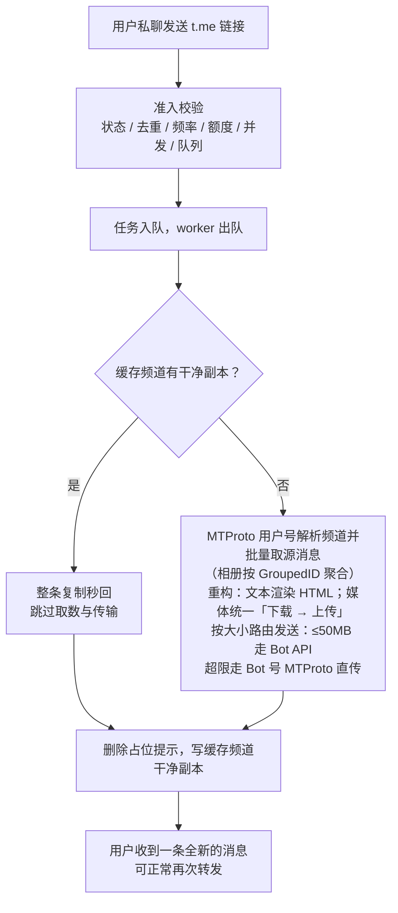

# 项目介绍

## 这个机器人解决什么问题

Telegram 频道开启「限制保存内容」后，消息无法转发、无法复制，普通 Bot 的 `forwardMessage` / `copyMessage` 也一样受限。

Spore 的做法是：把频道消息链接发给 Bot，系统通过 **MTProto 用户账号**读取源消息，重新构造为一条**全新消息**发回。新消息不保留 Forward Header，可正常再次转发。能否提取取决于登录的读取账号对源频道的访问权限。

核心原则一句话：

> Bot API 负责「和用户聊天」，MTProto 负责「以用户身份访问 Telegram」，业务层负责「把源消息转换成新的消息」。

## 核心功能

- **受保护消息提取**：支持文本、图片、视频、文件、音频、语音条与相册，保留加粗、链接等实体格式；超过 Bot API 50MB 上限的大文件经 Bot 身份 MTProto 直传（上限 2000MB），再超过的自动分卷拆分——视频切成可直接播放的分段（ffmpeg 流复制、无损），与同组媒体合成一条相册送达（上限约 17.6GB），无需下载合并。
- **Bot 交互**：私聊发链接即可使用；`/start` 申请、额度查询、进度、取消、频道绑定与加入等命令齐备，配额与重试边界明确。
- **云盘下载**：`/download` 把提取的媒体直接上传到网盘（经 rclone），不占用 Telegram 传输，支持多目的地、排队与取消。
- **缓存频道复用**：成功投递后同步写一份无脚注干净副本到自有缓存频道，同链接再次提交时整条复制秒回——不限媒体大小、相册保组。
- **已处理历史恢复**：从管理端发起后台任务，优先把已登记且可读的缓存副本复制到新的频道或超级群组；没有可用副本时，尝试由读取账号重新提取原来源。数据库仅保存索引和进度，不能单独还原消息正文或媒体。
- **Web 管理端**：内置 SPA 管理面板：用户审批与管理、请求记录、频道统计、运行设置、云盘配置、资源监控、审计与数据备份；定时备份支持只保留 R2 云端副本。
- **通知设置**：在同一页面配置 Telegram Bot、通用 JSON/飞书/钉钉/Discord Webhook 通道，并按事件目录提前设置通知规则、屏蔽和静音计划；凭据加密入库并随数据库备份。活动通知（管理后台登录、新用户申请、频道加入申请）默认开启，逐次推送关键信息。
- **频道加入**：`/join` 提交邀请链接让读取账号加入目标频道，经管理端审批后生效，支持静音、归档与数量上限。

## 设计原理

- **重构而非转发**：不走 Telegram 的转发/复制通道，而是读取源消息后从零构造新消息——从机制上绕开受保护限制，产物是干净的全新消息。
- **双通道架构**：Bot API 长轮询接收用户消息；MTProto 侧维持两个会话——**用户号**负责读源频道与下载，**Bot 号**负责大文件直传（自动登录，异常自动重连）。
- **统一「下载 → 上传」，按大小路由**：≤50MB 走 Bot API 上传，超限走 Bot 号 MTProto 直传（上限 2000MB），超限视频自动切为可播放分段整组送达；相册按整组总量判断，成员各自合规但总量超 Bot API 请求体上限的相册同样整组走 MTProto 直传。下载与上传重叠（边下边发），按媒体大小分流式 / 内存 / 临时文件三档策略；内存路径受进程级预算闸门约束（预算不足自动降级临时文件路径），内存占用被固定额度封顶、不随并发任务数放大。
- **单进程低依赖**：Go 单二进制 + 内嵌 SQLite，部署只需一个容器；消息正文与媒体本体不入库，无 Redis、无外部数据库。
- **默认收紧的访问控制**：白名单 Deny All，陌生用户 `/start` 申请、管理员审批后才能使用；每日额度、提交频率与并发数多重限制。

## 一次请求的流程

---

想直接用起来：看[快速部署](/guide/deployment)；命令与配额细节：看[Bot 使用指南](/guide/usage)；模块划分、关键决策与运行时全流程：看[架构文档](/reference/architecture)。
